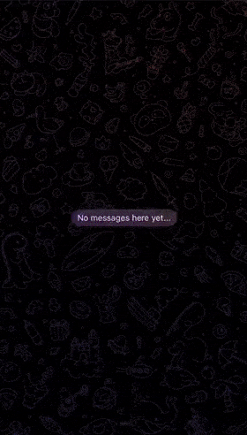

  <ul>
    
<h1 style="display: inline-block;">Telegram bot bringing popular topics on the internet</h1>

  </ul>

### Launch
1. Install GNU make and Docker
2. Insert your token from BotFather in .env.example and remove 'example' postfix
3. Run 'make build' command in terminal

### Stack
Logging: [Zerolog](https://github.com/rs/zerolog)  
Database: [MongoDB](https://www.mongodb.com/)  
Caching: [Redis](https://redis.io/)  
[Docker](https://www.docker.com/)
