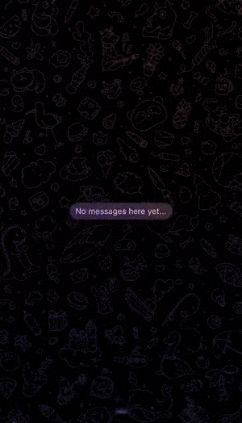

  <ul>
    
<h1 style="display: inline-block;">Telegram bot bringing popular topics on the internet</h1>

  </ul>

### Launch

1. Install GNU make and Docker
2. Paste your token from BotFather into .env.example and remove 'example' postfix
3. Run 'make build' command

### Stack

Logging: [Zerolog](https://github.com/rs/zerolog)  
Databases: [MongoDB](https://hub.docker.com/_/mongo), [PostgreSQL](https://hub.docker.com/_/postgres)  
Caching: [Redis](https://hub.docker.com/_/redis)  
Microservice communication: [gRPC](https://github.com/grpc/grpc)  

***
vladlen.polyakov@gmail.com
